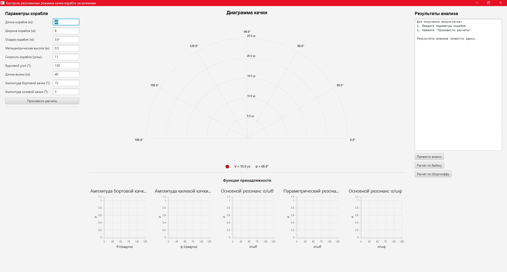
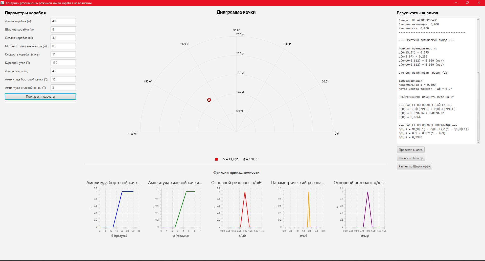
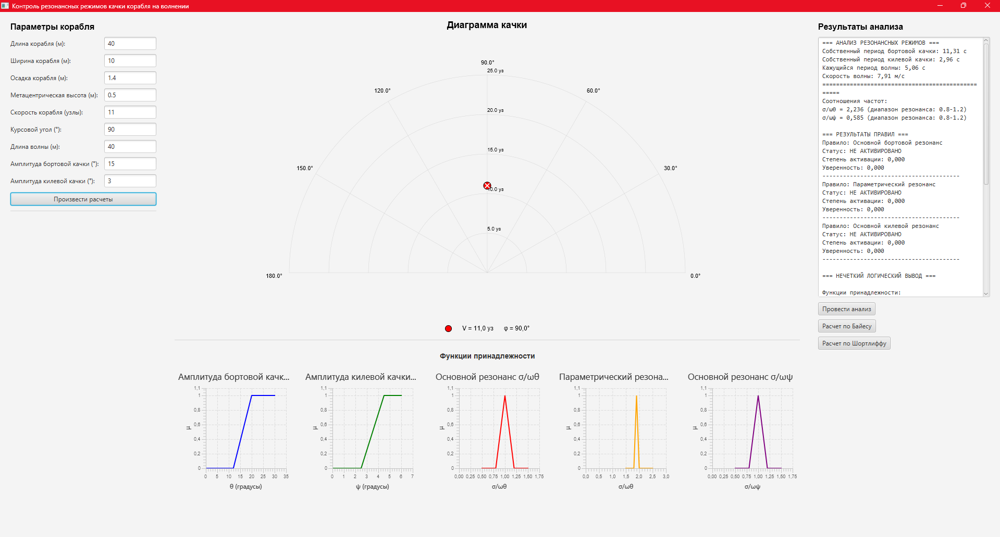
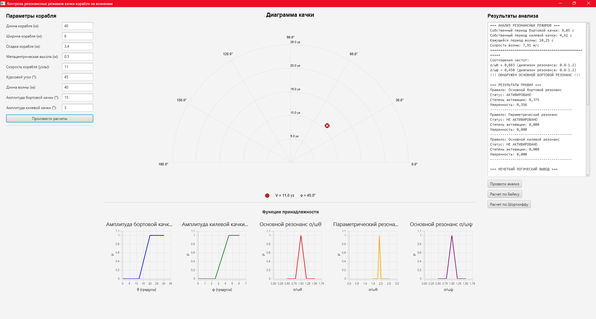
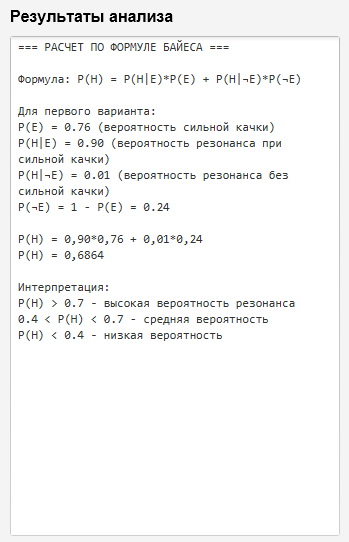
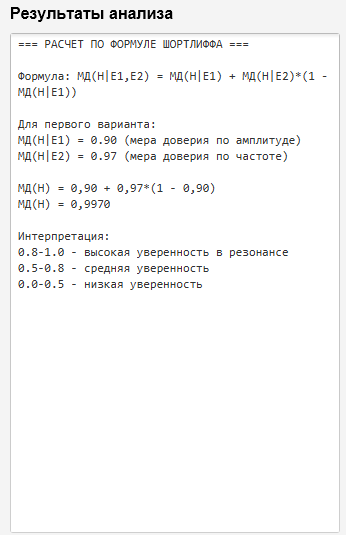

##  Курсовая работа 
### По дисциплине «Системы искусственного интеллекта»
### По теме: «Разработка системы искусственного интеллекта, обеспечивающей контроль резонансных режимов качки корабля на волнении»

Курсовой проект выполняется с целью уяснения механизма функционирования бортовых систем искусственного интеллекта на основе структурированной базы знаний для прямой и обратной цепочки рассуждений, а также при реализации нечеткого логического вывода в режиме реального времени. Система предназначена для оперативного контроля экстремальных ситуаций, связанных с оценкой резонансных режимов качки при движении корабля на волнении. В качестве исходной информации при функционировании интеллектуальной системы используются данные динамических измерений и материалы проектной документации заданного корабля.

### Скриншоты
#### Стартовое окно

#### Расчет по изначальным данным

#### Расчет с измененными данными

#### Расчет с боковым резонансом

### Результат анализа при боковом резонансе 
#### === АНАЛИЗ РЕЗОНАНСНЫХ РЕЖИМОВ ===
#### Собственный период бортовой качки: 9,05 с
#### Собственный период килевой качки: 4,61 с
#### Кажущийся период волны: 10,25 с
#### Скорость волны: 7,91 м/с
#### ==================================================
#### Соотношения частот:
#### σ/ωθ = 0,883 (диапазон резонанса: 0.8-1.2)
#### σ/ωψ = 0,450 (диапазон резонанса: 0.8-1.2)
#### !!! ОБНАРУЖЕН ОСНОВНОЙ БОРТОВОЙ РЕЗОНАНС !!!
#### === РЕЗУЛЬТАТЫ ПРАВИЛ ===
#### Правило: Основной бортовой резонанс
#### Статус: АКТИВИРОВАНО
#### Степень активации: 0,375
#### Уверенность: 0,356
#### ----------------------------------------
#### Правило: Параметрический резонанс
#### Статус: НЕ АКТИВИРОВАНО
#### Степень активации: 0,000
#### Уверенность: 0,000
#### ----------------------------------------
#### Правило: Основной килевой резонанс
#### Статус: НЕ АКТИВИРОВАНО
#### Степень активации: 0,000
#### Уверенность: 0,000
#### ----------------------------------------
#### === НЕЧЕТКИЙ ЛОГИЧЕСКИЙ ВЫВОД ===
#### Функции принадлежности:
#### μ(θ=15,0°) = 0,375
#### μ(ψ=3,0°) = 0,250
#### μ(σ/ωθ=0,883) = 0,417 (осн)
#### μ(σ/ωθ=0,883) = 0,000 (пар)
#### Степени истинности правил (α):
#### Правило 1 (Основной бортовой): α = min(0,375, 0,417) = 0,375
#### Дефаззификация:
#### Максимальная α = 0,375
#### Метод центра тяжести → Δφ = 14,9°
#### РЕКОМЕНДАЦИЯ: Изменить курс на 15°
#### === РАСЧЕТ ПО ФОРМУЛЕ БАЙЕСА ===
#### P(H) = P(H|E)*P(E) + P(H|¬E)*P(¬E)
#### P(H) = 0.9*0.76 + 0.01*0.32
#### P(H) = 0,6864
#### === РАСЧЕТ ПО ФОРМУЛЕ ШОРТЛИФФА ===
#### МД(H) = МД(H|E1) + МД(H|E2)*(1 - МД(H|E1))
#### МД(H) = 0.9 + 0.97*(1 - 0.9)
#### МД(H) = 0,9970

### Расчет по формуле Байеса

### Расчет по формуле Шортлиффа

